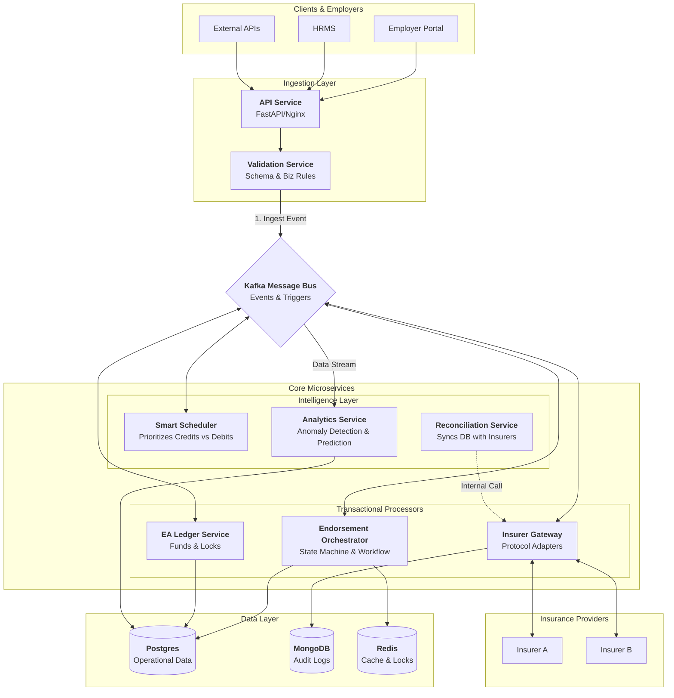

# Endorsement Management System {#endorsement-management-system}

[Endorsement Management System](#endorsement-management-system)

[1\. Introduction](#1.-introduction)

[2\. Goals](#2.-goals)

[3\. Scope](#3.-scope)

[4\. System Architecture](#4.-system-architecture)

[4.1 High-Level Component Diagram](#4.1-high-level-component-diagram)

[4.2 Component Descriptions](?tab=t.uu4lchgus0q#heading=h.tz5mh088z08b)

[5\. Data Model](?tab=t.uu4lchgus0q#heading=h.xb6iotaphlf2)

[5.1 Relational Data (PostgreSQL)](?tab=t.uu4lchgus0q#heading=h.a5bb3uomv8gv)

[5.2 Document Data (MongoDB)](?tab=t.uu4lchgus0q#heading=h.j6b4hokxxhfr)

[5.3 Transient Data (Redis)](?tab=t.uu4lchgus0q#heading=h.u6a5e3183wx9)

[6\. Interfaces and Integrations](?tab=t.uu4lchgus0q#heading=h.wwrfaqb6hf34)

[6.1 Internal Control Flow (Sequence Diagram)](?tab=t.uu4lchgus0q#heading=h.t1qk6yhcih4)

[6.2 External APIs](?tab=t.uu4lchgus0q#heading=h.gxpksp8t36vs)

[Authentication & Security Strategy](?tab=t.uu4lchgus0q#heading=h.tn3gc6gynfpl)

[6.3 Detailed API Specifications](?tab=t.uu4lchgus0q#heading=h.wj6a2lnw6qxc)

[Group 1: Ingestion APIs](?tab=t.uu4lchgus0q#heading=h.c3e2butsh5xc)

[Group 2: Callback APIs (Webhooks)](?tab=t.uu4lchgus0q#heading=h.r00orvw9kgcf)

[Group 3: Ledger APIs](?tab=t.uu4lchgus0q#heading=h.93ewklup2dr4)

[7\. Error Handling and Recovery](?tab=t.uu4lchgus0q#heading=h.6oesic4by3vq)

[7.1 The "Dead Letter Queue" (DLQ)](?tab=t.uu4lchgus0q#heading=h.xidci92cf8ml)

[7\. Security](?tab=t.uu4lchgus0q#heading=h.fxlxrtu3wse7)

[8\. Deployment](?tab=t.uu4lchgus0q#heading=h.9itgptdj0no7)

[9\. Monitoring and Logging](?tab=t.uu4lchgus0q#heading=h.e1e43yz8jljl)

[10\. Tech Stack](?tab=t.uu4lchgus0q#heading=h.w29shdeat845)

[11\. Future Scope](?tab=t.uu4lchgus0q#heading=h.7hhd4rfzlxxl)

[12\. Open Questions](?tab=t.uu4lchgus0q#heading=h.mf6cix7yeocj)

## 

## 1\. Introduction {#1.-introduction}

The Endorsement Management System (EMS) is a specialized middleware platform designed to bridge the gap between Employers (Group Insurance Policyholders) and Insurance Providers. In the context of group insurance, employee demographics change daily (hirings, firings, lifestyle changes). These changes, known as "endorsements," must be propagated to insurers to ensure coverage validity.

The core challenge this system addresses is the financial and operational friction of these changes. Employers must maintain a pre-funded "Endorsement Account" (EA) to pay for additions, while insurers operate on varying SLAs (Real-time vs. Batch). The EMS automates this workflow, optimizing cash flow and ensuring zero coverage gaps.

## 2\. Goals {#2.-goals}

The primary objectives of the EMS are:

* **Zero Coverage Gaps:** Ensure legally binding coverage from the exact date of eligibility, regardless of insurer processing time.  
* **Liquidity Optimization:** Minimize the capital required in the Endorsement Account (EA) by intelligently scheduling "Credits" (Deletions) before "Debits" (Additions).  
* **Scalability:** Support 100,000 employers generating \~1 million transactions daily across 10 different insurance providers.  
* **Resiliency:** Handle insurer downtime and API failures with robust retry mechanisms and Dead Letter Queues (DLQ).  
* **Visibility:** Provide real-time transparency into transaction status and account balances via websockets.

## 3\. Scope {#3.-scope}

**In-Scope:**

* **Endorsement Lifecycle:** End-to-end processing of Additions, Deletions, and Modifications of employee coverage.  
* **Financial Ledger:** Management of the Endorsement Account (EA), including locking funds, processing transactions, and handling insufficient funds (ISF) scenarios.  
* **Smart Scheduling:** Heuristic-based prioritization of transactions.  
* **Integrations:** Adapters for both Real-time (REST) and Batch (SFTP/SOAP) insurer interfaces.  
* **Reconciliation:** Automated nightly 2-way matching between internal records and insurer data.

**Out-of-Scope:**

* **New Business Policy Issuance:** The system assumes the master group policy already exists.  
* **Claims Processing:** Handling medical claims is distinct from membership management.  
* **Payment Gateway Implementation:** We integrate with gateways for top-ups, but building the gateway itself is out of scope.

## 4\. System Architecture {#4.-system-architecture}

The system follows an **Event-Driven Microservices Architecture** to ensure decoupling and high scalability.

### 4.1 High-Level Component Diagram {#4.1-high-level-component-diagram}

The core microservices are arranged to separate the "Active Transaction Path" from "Reliability & Support Services."


### 4.2 Component Descriptions

**Ingestion & Validation Service:** 

* Validates payload schema (JSON schema/Business rules).  
* Hash the payload (SHA-256) and reject if the same hash arrives within 24 hours for an employer.  
* Assigns a `TrackingID`.  
* Produces an event to Kafka topic: `endorsement.ingested`.

**Smart Scheduler (Optimizer):** 

* Listens to `endorsement.ingested`.  
* Consumes raw requests and reorders them. It prioritizes "Credits" (refunds) before "Debits" to maximize EA balance availability.  
* Groups requests into efficient batches for the specific Insurer.  
* Uses a Tumbling Window of N minutes (configurable per employer). Incoming requests are buffered in Redis. At the end of the window, the heap sort runs (Deletes first)  
* Pushes re-ordered tasks to `endorsement.ready_process`.

**Endorsement Orchestrator:** 

* This manages the central state machine.  
* Tracks the lifecycle of an endorsement request:   
  `RECEIVED` \-\> `VALIDATED` \-\> `FUND_LOCKED` \-\> `SENT_TO_INSURER` \-\> `CONFIRMED` \-\> `ACTIVE`.  
* Handles Retries: If an insurer API fails, this component manages the exponential backoff strategies.  
* Ensures "No Gap": Records the `RequestedDate` in Postgres. Even if the insurer confirms 3 days later, the policy effective date is backdated to `RequestedDate`.

**EA Ledger Service:** 

* Enforces ACID compliance  
* Manages the "Endorsement Account" (EA).  
* Financial Check \- Checks if `Current Balance + Pending Credits - Pending Debits > 0`.  
* Insufficient funds \- Mark transaction as `ON_HOLD_FUNDS` and handle using the “park and wake” strategy.  
* Uses **Redis** for distributed locking to prevent double-spending during concurrent requests.  
* Utilizes PostgreSQL Row-Level Locking (SELECT ... FOR UPDATE) on the employer table during balance checks to guarantee ACID compliance, using Redis only as a first-line optimization.

**Insurer Gateway:** 

* A polymorphic adapter service that translates internal events into insurer-specific formats (JSON, XML, CSV).  
* Knows if Insurer A takes JSON REST API and Insurer B takes an XML Batch file via SFTP.  
* We will generate a deterministic `Idempotency-Key` (UUID) for every request and send it in the header `X-Idempotency-Key`.  
* **Mongo Integration:** Stores the *exact* raw request sent and response received from the insurer in **MongoDB**. This is crucial for debugging disputes ("We sent the file on Tuesday, here is the payload").

**Analytics Service:** 

* Anomaly Detection:  
  * The `AnalyticsService` monitors the velocity of requests per Employer.  
  * If `Requests_Per_Minute` \> `3x Standard_Deviation` of the employer's history → **Trigger Circuit Breaker**.  
  * Pause processing for that employer, move requests to a "Review Queue," and alert the Operations Team.  
* Generate Insights  
  * The `AnalyticsService` monitors and analyzes historical endorsement patterns (e.g., "Company A always adds interns in June").  
  * Predictive Cash Flow Management using **Time Series Forecasting** (e.g., Facebook Prophet or ARIMA).  
  * The system notifies the Finance Manager with "Predicted Top-Up."  For ex., *"Based on last year's trends, you will likely need $5,000 next week for seasonal hiring. Please top up now to avoid coverage gaps."*

**Reconciliation Service:** 

* `ReconciliationBot` monitors for any discrepancies between our internal Ledger and External Insurer’s records  
* Runs on a schedule (e.g., Nightly) or event-triggered (Post-Batch).  
* Uses the Two-way Match algorithm to identify ghost policies (risk of gap) or zombie policies (financial leak).  
* If the Insurer returns a different Effective Date than requested, the system will update the local `policy_coverage` table to match the Insurer's date and generate a `DATE_MISMATCH` warning event for the HR Admin.

## 5\. Data Model

We utilize a **Polyglot Persistence** strategy. As a rule, all timestamps will be stored in UTC and will be converted to locale specific date/time on the Frontend or the User Notification Layer.

### 5.1 Relational Data (PostgreSQL)

Here is the detailed Data Model specification optimized for **PostgreSQL**.

I have expanded your high-level list into concrete schema definitions, adding critical fields like Audit Timestamps (`created_at`, `updated_at`), Foreign Keys for referential integrity, and specific Data Types (using `JSONB` for flexibility and `DECIMAL` for financial accuracy).

### 1\. Table: `employers`

Stores the master data for the group policyholders.

| Column Name | Data Type | Constraints | Description |
| :---- | :---- | :---- | :---- |
| **id** | `UUID` | `PRIMARY KEY` | Unique identifier for the employer. |
| **name** | `VARCHAR(255)` | `NOT NULL` | Legal name of the company. |
| **ea\_balance** | `DECIMAL(15, 2)` | `DEFAULT 0.00` | Current funds available in Endorsement Account. |
| **config** | `JSONB` | `NOT NULL` | Stores SLA settings, Low Balance Thresholds, Webhook URLs. |
| **status** | `VARCHAR(20)` | `DEFAULT 'ACTIVE'` | `ACTIVE`, `SUSPENDED` (if balance \< 0). |
| **created\_at** | `TIMESTAMPTZ` | `DEFAULT NOW()` | Audit timestamp. |
| **updated\_at** | `TIMESTAMPTZ` | `DEFAULT NOW()` | Audit timestamp. |

**Example `config` JSONB:**

| {  "low\_balance\_threshold": 1000.00,  "notification\_email": "finance@abc.xyz",  "allowed\_overdraft": false} |
| :---- |

---

### 2\. Table: `employees`

Stores the census data. Note that we store `demographics` as JSONB to accommodate varying data requirements across different insurers without changing the schema.

| Column Name | Data Type | Constraints | Description |
| :---- | :---- | :---- | :---- |
| **id** | `UUID` | `PRIMARY KEY` | Internal unique ID. |
| **employer\_id** | `UUID` | `FOREIGN KEY` | References `employers(id)`. |
| **employee\_code** | `VARCHAR(50)` | `NOT NULL` | The employer's internal ID (e.g., Payroll ID). |
| **demographics** | `JSONB` | `NOT NULL` | PII Data: DOB, Gender, Address, Marital Status. |
| **created\_at** | `TIMESTAMPTZ` | `DEFAULT NOW()` | Audit timestamp. |
| **updated\_at** | `TIMESTAMPTZ` | `DEFAULT NOW()` | Audit timestamp. |

---

### 3\. Table: `policy_coverages`

Tracks the actual insurance coverage span for an employee.

| Column Name | Data Type | Constraints | Description |
| :---- | :---- | :---- | :---- |
| **id** | `UUID` | `PRIMARY KEY` | Unique Policy ID. |
| **employee\_id** | `UUID` | `FOREIGN KEY` | References `employees(id)`. |
| **insurer\_id** | `VARCHAR(50)` | `NOT NULL` | ID of the external provider (e.g., "AETNA\_01"). |
| **status** | `VARCHAR(20)` | `NOT NULL` | `ACTIVE`, `INACTIVE`, `PENDING_ISSUANCE`. |
| **start\_date** | `DATE` | `NOT NULL` | The "No Gap" effective date. |
| **end\_date** | `DATE` | `NULLABLE` | Null if active; set upon deletion. |
| **plan\_details** | `JSONB` | `NULLABLE` | Specifics like Plan ID, Tier (Gold/Silver). |
| **created\_at** | `TIMESTAMPTZ` | `DEFAULT NOW()` | Audit timestamp. |

---

### 4\. Table: `endorsement_requests`

The core transaction table. This tracks the lifecycle of the change request.

| Column Name | Data Type | Constraints | Description |
| :---- | :---- | :---- | :---- |
| **id** | `UUID` | `PRIMARY KEY` | Unique Request ID (Tracking ID). |
| **employer\_id** | `UUID` | `FOREIGN KEY` | References `employers(id)`. |
| **type** | `VARCHAR(20)` | `NOT NULL` | `ADDITION`, `DELETION`, `MODIFICATION`. |
| **status** | `VARCHAR(30)` | `NOT NULL` | `RECEIVED`, `FUNDS_LOCKED`, `SENT`, `COMPLETED`, `FAILED`, `ON_HOLD`. |
| **payload** | `JSONB` | `NOT NULL` | The full original request payload (for retries). |
| **retry\_count** | `INTEGER` | `DEFAULT 0` | For exponential backoff tracking. |
| **effective\_date** | `DATE` | `NOT NULL` | The requested date of change. |
| **trace\_id** | `VARCHAR(64)` | `NULLABLE` | For OpenTelemetry distributed tracing. |
| **created\_at** | `TIMESTAMPTZ` | `DEFAULT NOW()` | Audit timestamp. |

---

### 5\. Table: `ledger_transactions`

The financial audit trail. This table should be immutable

| Column Name | Data Type | Constraints | Description |
| :---- | :---- | :---- | :---- |
| **id** | `UUID` | `PRIMARY KEY` | Unique Transaction ID. |
| **employer\_id** | `UUID` | `FOREIGN KEY` | References `employers(id)`. |
| **endorsement\_id** | `UUID` | `NULLABLE, FK` | References `endorsement_requests(id)`. Null if Top-up. |
| **type** | `VARCHAR(20)` | `NOT NULL` | `DEBIT` (Cost), `CREDIT` (Refund/Top-up). |
| **amount** | `DECIMAL(15, 2)` | `NOT NULL` | The monetary value. |
| **status** | `VARCHAR(20)` | `NOT NULL` | `LOCKED`, `CLEARED`, `FAILED`, `PENDING`. |
| **external\_ref** | `VARCHAR(100)` | `NULLABLE` | Gateway Transaction ID (e.g., Stripe ID). |
| **created\_at** | `TIMESTAMPTZ` | `DEFAULT NOW()` | Time the financial event occurred. |

### 5.2 Document Data (MongoDB)

Used for audit trails and storing unstructured payloads.

**`audit_logs`**: Stores the exact JSON sent to the insurer and the raw response received. This is critical for legal disputes regarding coverage timing.

| {    "\_id": ObjectId("651a..."),             // Mongo Auto-ID    "endorsement\_id": "c615...",            // UUID (String) \- Links to Postgres endorsement\_requests.id    "trace\_id": "a1b2...",                  // String \- OpenTelemetry Trace ID for debugging across services    "insurer\_id": "AETNA\_01",               // String \- The target external system    "timestamp": ISODate("2023-10-01T..."), // Time of the interaction    "interaction\_type": "REST\_API",         // Enum: "REST\_API", "SOAP\_XML", "SFTP\_BATCH"// Performance Metrics    "latency\_ms": 450,                      // Number \- Time taken for insurer to respond    "status": "SUCCESS",                    // Enum: "SUCCESS", "FAILURE", "TIMEOUT"// 1\. The Request We Sent    "request": {      "url": "https://api.insurer.com/v1/members",      "method": "POST",      "headers": {                          // SANITIZED: Auth tokens removed/masked        "Content-Type": "application/json",        "X-Api-Key": "MASKED"      },      "body": {                             // The Raw Payload (JSON or XML String)        "member": {          "firstName": "John",          "ssn": "\*\*\*\*\*\*\*\*\*\*\*"              // Application-level masking applied        }      }    },// 2\. The Response We Received    "response": {      "status\_code": 200,      "headers": {        "Date": "Sun, 01 Oct 2023...",        "Server": "nginx"      },      "body": {                             // The Raw Response        "confirmationId": "POL-998877",        "status": "PROCESSED"      }    },// 3\. Exception Details (Only if interaction failed)    "error": {                              // Nullable      "code": "econn\_refused",      "message": "Connection timed out after 5000ms",      "stack\_trace": "..."    }  } |
| :---- |

### 5.3 Transient Data (Redis)

Used for high-speed access and locking.

* **Caching:** Current EA Balance per employer.  
* **Distributed Locks:** Prevents double-spending during concurrent ledger updates.  
* **Websocket Sessions:** Mapping UserIDs to active socket connections.

## 6\. Interfaces and Integrations

### 6.1 Internal Control Flow (Sequence Diagram)

The following swimlane diagram details the flow of data from ingestion to notification.
```Mermaid
sequenceDiagram

    autonumber

    

    %% -- ACTORS & SWIMLANES --

    actor User as Employer/Portal

    

    box rgb(240, 248, 255) Ingestion Layer

        participant Gateway as API Gateway

        participant Validator as Validation Svc

    end

    

    box rgb(255, 243, 224) The Event Bus

        participant Kafka as Kafka

    end

    

    box rgb(232, 245, 233) Core Microservices

        participant Scheduler as Smart Scheduler

        participant Orch as Orchestrator

        participant Ledger as EA Ledger

        participant IG as Insurer Gateway

    end

    

    box rgb(245, 245, 245) Data & Support

        participant DB as Postgres/Mongo

        participant Notify as Notification Svc

    end

    

    participant Insurer as External Insurer

    

    %% -- FLOW STARTS --

    

    rect rgb(225, 245, 254)

    note right of User: PHASE 1: INGESTION (Sync)

    User->>Gateway: POST /endorsement (JSON/CSV)

    Gateway->>Validator: Validate Schema & Rules

    Validator-->>Gateway: OK / Bad Request

    Gateway->>Kafka: Produce: endorsement.ingested

    Gateway-->>User: 202 Accepted (TrackingID)

    end

    

    rect rgb(255, 253, 231)

    note right of User: PHASE 2: OPTIMIZATION (Async)

    Kafka-->>Scheduler: Consume: endorsement.ingested

    Scheduler->>Scheduler: Re-order Queue (Delete First)

    Scheduler->>Kafka: Produce: endorsement.prioritized

    end

    

    rect rgb(232, 245, 233)

    note right of User: PHASE 3: FINANCIAL CHECK

    Kafka-->>Orch: Consume: prioritized

    Orch->>Kafka: Produce: ledger.check_funds

    Kafka-->>Ledger: Consume: ledger.check_funds

    Ledger->>DB: Check Balance & Lock Funds

    DB-->>Ledger: Success

    Ledger->>Kafka: Produce: funds.locked

    end

    rect rgb(253, 237, 236)

    note right of User: PHASE 4: EXECUTION

    Kafka-->>Orch: Consume: funds.locked

    Orch->>IG: Command: Execute Request

    IG->>Insurer: POST /endorsement (REST/SOAP)

    Insurer-->>IG: 200 OK (Confirmed)

    IG->>DB: Log Raw Payload (Mongo)

    IG->>Kafka: Produce: insurer.success

    end

    rect rgb(240, 248, 255)

    note right of User: PHASE 5: FINALIZATION

    Kafka-->>Orch: Consume: insurer.success

    Orch->>DB: Update Policy Status = ACTIVE

    Orch->>Kafka: Produce: endorsement.completed

    

    par Parallel Notification

        Kafka-->>Notify: Consume: completed

        Notify-->>User: WebSocket Push: "Active"

    and Parallel Analytics

        Kafka-->>Notify: (Analytics Service Listens)

        Notify->>DB: Update Anomaly Models

    end

    end
```
### 6.2 External APIs

* **Ingestion API (REST):** `POST /api/v1/endorsements`  
* **Bulk Upload (REST):** `POST /api/v1/endorsements/batch` (Accepts CSV/Excel)  
* **Callback API (REST):** `POST /api/v1/insurers/{insurer_id}/notify`  
* **Bulk Callback API (REST):** `POST /api/v1/insurers/{insurer_id}/batch-notify`  
* **Ledger Balance API (REST):** `GET /api/v1/ledger/balance`  
* **Ledger Top-up API (REST):** `POST /api/v1/ledger/topup`  
* **Ledger History API (REST):** `GET /api/v1/ledger/history`  
* **Websocket:** `wss://api.ems.com/ws/notifications?employerId={id}`

Authentication & Security Strategy  
Since the consumers vary, the security model differs for each group:

| API Group | Consumer | Auth Mechanism | Rationale |
| :---- | :---- | :---- | :---- |
| **Ingestion** | HRMS / Portal | OAuth2 (Bearer JWT) | Standard for user/system context. Allows Role-Based Access (RBAC) to ensure only HR Admins can endorse. |
| **Ledger** | Finance Admin / Gateway | OAuth2 (Bearer JWT) | High security required for financial transactions. |
| **Callback** | External Insurers | HMAC Signature \+ IP Whitelist | Insurers sign the payload using a shared secret. This proves the request came from them and hasn't been tampered with. |

### 6.3 Detailed API Specifications

### Group 1: Ingestion APIs

**Base URL:** `/api/v1/endorsements`

**1\. Create Single Endorsement**

* **Endpoint:** `POST /`  
* **Description:** Submits a request to add, remove, or modify an employee's coverage.  
* **Headers:** `Authorization: Bearer <JWT_TOKEN>`

**Request Payload (JSON):**

| {  "employer\_id": "emp\_987654321",  "request\_type": "ADDITION",  // Enum: ADDITION, DELETION, MODIFICATION  "effective\_date": "2023-10-01", // The "No Gap" date  "employee": {    "employee\_id": "E12345",    "first\_name": "John",    "last\_name": "Doe",    "dob": "1990-05-20",    "gender": "M",    "email": "john.doe@company.com"  },  "coverage": {    "plan\_id": "PLAN\_GOLD\_001",    "tier": "EMPLOYEE\_ONLY",    "insurer\_id": "INSURER\_A"  },  "metadata": {    "reason": "New Hire",    "department": "Engineering"  }} |
| :---- |

**2\. Batch Endorsement Upload**

* **Endpoint:** `POST /batch`  
* **Description:** Uploads a CSV or JSON file for bulk processing.  
* **Headers:** `Authorization: Bearer <JWT_TOKEN>`  
* **Body:** `multipart/form-data` (File)  
* **Response:**

| {  "batch\_id": "batch\_xyz\_789",  "status": "PROCESSING",  "message": "File accepted. 150 records queued."} |
| :---- |

---

### Group 2: Callback APIs (Webhooks)

**Base URL:** `/api/v1/webhooks`

**1\. Insurer Status Update**

* **Endpoint:** `POST /insurers/{insurer_id}/notify`  
* **Description:** The insurer calls this to confirm a policy is active or to report an error.  
* **Headers:**  
  * `X-Insurer-Signature`: `sha256=<hmac_signature>` (For security verification)  
  * `Content-Type`: `application/json`

**Request Payload (JSON):**

| {  "event\_type": "POLICY\_ISSUANCE", // Enum: POLICY\_ISSUANCE, ERROR, CANCELLATION  "timestamp": "2023-10-01T14:30:00Z",  "data": {    "reference\_id": "req\_abc123",  // The TrackingID we sent them    "insurer\_policy\_number": "POL-99887766",    "status": "SUCCESS",    "effective\_start\_date": "2023-10-01",    "error\_details": null  }} |
| :---- |

**2\. Batch Completion Webhook**

* **Endpoint:** `POST /insurers/{insurer_id}/batch-notify`  
* **Description:** Used by "Batch" insurers (like Insurer B) to notify that a file upload has been processed.  
* **Payload:**

| {  "batch\_reference": "batch\_xyz\_789",  "status": "COMPLETED\_WITH\_ERRORS",  "processed\_count": 150,  "success\_count": 148,  "failed\_records": \[    {      "reference\_id": "req\_001",      "reason": "Invalid DOB format"    },    {      "reference\_id": "req\_055",      "reason": "Duplicate Entry"    }  \]} |
| :---- |

---

### Group 3: Ledger APIs

**Base URL:** `/api/v1/ledger`

**1\. Get Account Balance**

* **Endpoint:** `GET /balance`  
* **Description:** Returns the current available funds, locked funds, and minimum threshold.  
* **Query Params:** `employer_id={id}`  
* **Response:**

| {  "employer\_id": "emp\_987654321",  "currency": "USD",  "available\_balance": 5000.00,  "locked\_funds": 1200.00, // Reserved for pending endorsements  "total\_balance": 6200.00,  "low\_balance\_threshold": 1000.00,  "status": "ACTIVE" // or LOW\_BALANCE, SUSPENDED} |
| :---- |

**2\. Top-Up Account (Add Funds)**

* **Endpoint:** `POST /topup`  
* **Description:** Triggered by a Payment Gateway (like Stripe/Razorpay) webhook OR a manual Finance Admin action to credit the account.  
* **Headers:** `Authorization: Bearer <JWT_TOKEN>` (If Admin) or `X-Webhook-Signature` (If Gateway)

**Request Payload (JSON):**

| {  "employer\_id": "emp\_987654321",  "transaction\_reference": "tx\_stripe\_12345", // External Gateway ID  "amount": 2500.00,  "currency": "USD",  "payment\_method": "ACH\_TRANSFER",  "timestamp": "2023-10-02T10:00:00Z"} |
| :---- |

**3\. Get Transaction History**

* **Endpoint:** `GET /history`  
* **Description:** Returns the audit trail of debits (endorsements) and credits (top-ups/refunds).  
* **Response:**

| {  "transactions": \[    {      "id": "tx\_local\_001",      "date": "2023-10-01",      "type": "DEBIT",      "amount": \-50.00,      "description": "Endorsement: Add John Doe",      "status": "CLEARED"    },    {      "id": "tx\_local\_002",      "date": "2023-09-28",      "type": "CREDIT",      "amount": 5000.00,      "description": "Top-up via Wire Transfer",      "status": "CLEARED"    }  \]} |
| :---- |

## 7\. Error Handling and Recovery

We need to distinguish between **Technical Failures** (Network blip) and **Business Failures** (Invalid Data/state). We will leverage two error handling strategies in order to deal with failures:

#### 7.1 The "Dead Letter Queue" (DLQ)

We will leverage **Kafka** topic structures for this.

1. **Main Topic:** `insurer.request` (The happy path).  
2. **Retry Topic:** `insurer.request.retry` (Delayed consumption).  
3. **DLQ Topic:** `insurer.request.dlq` (Human intervention required).

Technical Failures:  
*Initial Failure:* Orchestrator attempts call, receives an error.  
*Retry Mechanism:* The request is published to a retry topic with an exponential backoff strategy (e.g., 5 mins, 15 mins, 1 hour).  
*Final Failure:* After a maximum number of retries (e.g., 5 attempts), the request moves to a Dead Letter Queue (DLQ).

Business Failures:  
*Immediate Action*: No retry is attempted.  
*Final Failure*: The request moves immediately to the DLQ.  
*Communication*: The Employer is alerted that action is required (e.g., "Invalid Date of Birth... Please correct and resubmit.").

7.2 The “Park and Wake”  
When the Ledger Service declines a transaction due to low balance, the Orchestrator sets the status to **ON\_HOLD\_FUNDS** (*Park the transaction*). The Employer is immediately notified via Email/SMS and a UI alert ("Pay to Proceed").

The request is parked in the Postgres database and removed from the active Kafka queue.

The Ledger Service emits a `ledger.balance_increased` Kafka event only when the Employer tops up or a credit (Deletion) endorsement releases funds. A specific listener, `HoldReleaseService`, consumes this event, queries Postgres for all **ON\_HOLD\_FUNDS** items (*Wake the transaction*), and re-injects them into the `endorsement.process` Kafka topic for retry.

## 7\. Security

* **Authentication/Authorization:** OAuth2 with OIDC (via Keycloak) for all API access. Role-Based Access Control (RBAC) ensures only HR Admins can trigger financial transactions.  
* **Data Encryption:**  
  * **At Rest:** AES-256 encryption for Postgres and Mongo volumes.  
  * **In Transit:** TLS 1.3 for all internal and external communication.  
* **PII/PHI Compliance:** Strict separation of PII (Personally Identifiable Information). Logs in MongoDB must mask sensitive fields (SSN, DOB) to ensure GDPR/HIPAA compliance.

## 8\. Deployment

* **Containerization:** All services are Dockerized.  
* **Orchestration:** Docker Compose is used for local development/testing. Kubernetes (Helm charts) for production.  
* Secret Management: .env for local development/testing. Kubernetes Secrets for production.  
* **Scalability Strategy:**  
  * Stateless Services (Gateway, Validator, Adapter): Auto-scaled horizontally based on CPU/Memory.  
  * Kafka Consumers: Scaled based on "Consumer Group Lag."  
  * Database: Read Replicas for Postgres to handle high reporting loads.

## 9\. Monitoring and Logging

* **Distributed Tracing:** OpenTelemetry integrated into all Python services to trace a `TrackingID` across Kafka, Redis, and DBs.  
* **Metrics:** Prometheus to scrape metrics (e.g., `ea_balance_low`, `insurer_api_latency`, `queue_depth`). Grafana for visualization.  
* **Centralized Logging:** Signoz or similar to aggregate logs from all Docker containers.

## 10\. Tech Stack

* **Language:** Python 3.14+ (FastAPI for REST, confluent-kafka for Kafka messaging, alembic for data migration).  
* **Databases:** PostgreSQL 15, MongoDB 6.0, Redis 7.0.  
* **Message Broker:** Apache Kafka.  
* **Infrastructure:** Docker, Docker Compose.  
* **Libraries:**  
  * `Pydantic`: Data validation.  
  * `confluent-kafka`: Kafka client library (high-performance C bindings).  
  * `Scikit-Learn`: Anomaly detection models.

## 11\. Future Scope

* **Blockchain Ledger:** Implementing a private Hyperledger Fabric chain for the Endorsement Account to provide immutable, shared trust between Insurers and Employers.  
* **Multi-Region Support:** Deploying active-active across multiple geographic regions for disaster recovery.  
* **Dynamic Pricing:** Integrating real-time underwriting engines to calculate premium changes based on live risk data rather than static age bands.  
* **Regulatory Data Residency:** Data Residency laws may require specific insurers to store data in specific jurisdictions. This may impact cloud deployment strategy.  
* **Payment Gateway Latency:** Provision for employer credit (based on policy constraints) that allow a company provisional credit for immediate endorsements, even though their transfers are enroute.  
* **Support for SFTP based ingestion:** Add a `File Watcher` component that monitors the SFTP mount, parses CSVs into JSON, and calls the Ingestion API locally.

## 12\. Open Questions

* **Insurer Protocol Specifics:** Do all 10 insurers support idempotent retry tokens? If not, duplicate detection logic in the Adapter layer needs to be highly aggressive.